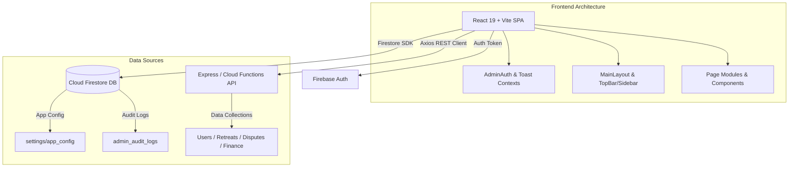
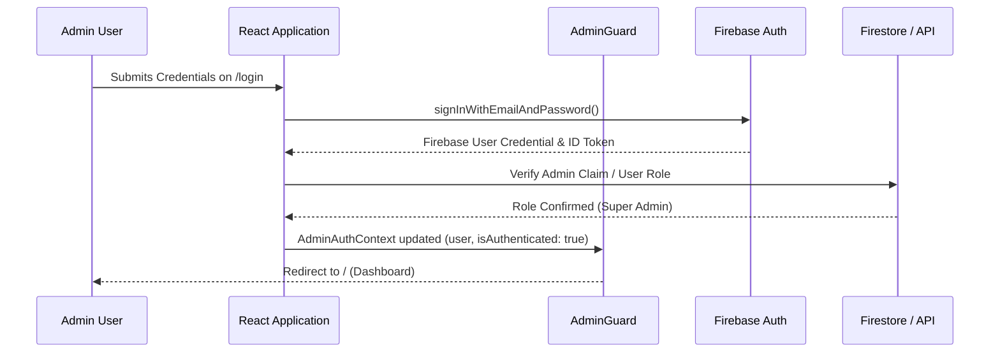

# UltraHealers Admin Console — Architecture Specification

---

## 🏛️ Overall System Architecture

The UltraHealers Admin Console follows a modern client-side single page application (SPA) architecture integrated with Firebase cloud services and RESTful API endpoints.

---

## 💻 Frontend Architecture

- **Core Framework**: React 19 with TypeScript in strict mode.
- **Build Tool & Bundler**: Vite 7 with Fast Refresh and PostCSS processing.
- **Routing**: `react-router-dom` v6 with layout wrappers (`Layout.tsx`) and route protection guards (`AdminGuard.tsx`).
- **UI Design System**:
  - Tailwind CSS v4 with custom utility classes.
  - Headless UI primitives via Radix UI (`@radix-ui/react-dialog`, `react-dropdown-menu`, `react-tabs`, `react-select`).
  - Iconography via `lucide-react`.
  - Rich Text Editing via Tiptap (`@tiptap/react`).
  - Drag and Drop via `@dnd-kit/core` & `@dnd-kit/sortable`.
- **Data Visualization & Analytics**: `recharts` for interactive line, bar, and pie charts.

---

## ☁️ Backend Architecture & Integrations

- **Authentication**: Firebase Auth using Email/Password credential login and custom admin token claims.
- **Database (Cloud Firestore)**:
  - `settings/app_config`: Holds global application configuration parameters.
  - `admin_audit_logs`: Immutable collection logging admin state changes, status updates, and config edits.
  - `campaigns`: Marketing campaign metadata and stats.
- **REST API Integration Layer**:
  - `axios` instance configured with base URL, request interceptors (attaching Auth Bearer tokens), and global error handlers.

---

## ⚡ State Management Patterns

1. **Global Auth State (`AdminAuthContext.tsx`)**: Manages current admin user identity, authentication status, login/logout methods, and role verification.
2. **Global Notification State (`ToastContext.tsx`)**: Provides application-wide toast notifications (`react-hot-toast`).
3. **Module Local State**: Custom React hooks (`useCampaigns`, `useReports`) manage table filtering, search keywords, pagination, and modal dialog states.

---

## 🔒 Authentication & Authorization Flow

---

## 📊 Reporting & Export Architecture

- **CSV Export Engine**: `papaparse` handles client-side array-to-CSV transformation and stream downloading.
- **PDF Export Engine**: `jspdf` & `jspdf-autotable` paired with `html-to-image` / `html2canvas` generate structured PDF reports.
- **Excel Export Engine**: `xlsx` generates multi-sheet Excel workbooks for financial and user activity reports.
