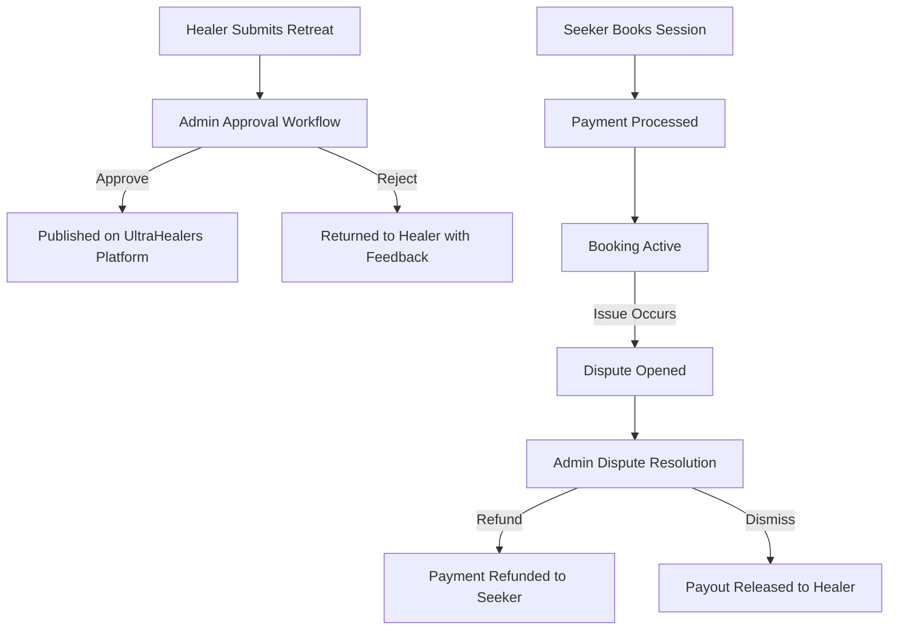

# UltraHealers Admin Console — Project Overview

---

## 🎯 System Purpose
The **UltraHealers Admin Console** is a specialized Content Management System (CMS) and operational administration dashboard for the **UltraHealers** platform. It equips platform administrators, support personnel, and content managers with tools to manage users (Healers & Seekers), review and approve retreat listings, oversee booking operations, resolve user disputes, monitor financial metrics, run marketing campaigns, configure system modalities, and audit platform activity.

---

## 🏥 Business Domain
- **Industry**: Health, Holistic Healing, Wellness Retreats, and Alternative Medicine.
- **Core Platform Entities**:
  - **Healers**: Service providers, retreat hosts, and holistic practitioners.
  - **Seekers**: End users, patients, and wellness clients looking for healing services.
  - **Retreats & Listings**: Wellness workshops, residential retreats, and therapy sessions.
  - **Bookings**: Scheduled sessions and retreat enrollments.
  - **Disputes**: Claims and refunds between Seekers and Healers.
  - **Campaigns**: Marketing promotions, email/SMS broadcasts, and promo codes.

---

## 🧩 Major Modules
1. **Authentication & Authorization**: Firebase Auth integration with role-based access control (RBAC).
2. **Dashboard**: High-level KPI metrics, real-time activity feeds, revenue charts, and quick actions.
3. **User Management**: Unified and split management for Healers (practitioners) and Seekers (clients) with profile verification and status controls.
4. **Retreats & Listings**: Multi-step approval workflows, content moderation, status toggling, and detail inspection.
5. **Bookings & Dispute Resolution**: Session scheduling oversight, retreat enrollments, dispute investigation, evidence review, and refund issuance.
6. **Finance & Payments**: Platform revenue overview, payout tracking, transaction history, and fee breakdown.
7. **Campaigns & Marketing**: Promotional campaign creation, target audience selection, budget tracking, and performance analytics.
8. **Modalities & SEO**: System-wide healing modality taxonomy management and SEO metadata optimization.
9. **Reports & Analytics**: Comprehensive exports (CSV/PDF/Excel) for user registrations, revenue, bookings, and platform growth.
10. **Settings & Audit Logs**: System configuration parameters stored in Firestore (`settings/app_config`) and immutable audit logs (`admin_audit_logs`).

---

## 👤 User Roles & Access Hierarchy
- **Super Administrator**: Full system access, platform configuration, user role management, and audit log inspection.
- **Support Agent**: Handles user tickets, dispute resolution, booking inquiries, and healer verification.
- **Content Manager**: Manages retreats approval, modality definitions, marketing campaigns, and SEO metadata.
- **Financial Auditor**: Access to revenue charts, payout logs, transaction histories, and financial exports.

---

## 🔄 Core Business Workflows

---

## 🏗️ High-Level Architecture Overview
- **Frontend Stack**: React 19, TypeScript 5.9, Vite 7, Tailwind CSS 4, Radix UI primitives, Recharts.
- **Backend & Database**: Firebase Authentication, Cloud Firestore, Cloud Functions / REST APIs via Axios.
- **Data Export Engine**: PapaParse (CSV), jsPDF / html2canvas (PDF), XLSX (Excel).
